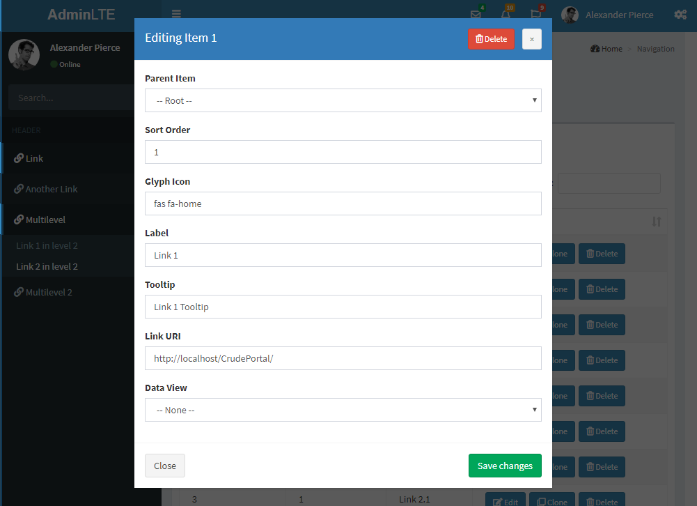

# CRUDE-ASP

CRUDE:

- **C**reate
- **R**ead
- **U**pdate
- **D**elete
- **E**xecute

This project aims to implement an easy-to-use platform to create CRUD Application websites using the most-available free technologies (classic ASP, bootstrap, fontawesome, jquery, etc.), plus "Execute" functionality to expand database capabilities.
Using this project you can easily create "Data Views" which would serve as CRUD interfaces where you can manipulate data from a SQL Server database, and to also execute custom database commands (such as stored procedures).

No coding knowledge required! All configuration and management of the CRUD elements are completely online with a GUI. This means CRUDE-ASP is essentially a "low-code development platform".

The project should be optimal for rapid application development of simple LOB (line-of-business) applications.
There's absolutely NO programming knowledge required.
It could of course come in handy for the more advanced scenarios, but in the most part, you should be able to implement most common application features using the easy-to-understand UI of CRUDE, without writing a single word of code.

[Please see the Wiki for more info](https://github.com/EitanBlumin/CRUDE-ASP/wiki)

## Getting Started

These instructions will get you up and running on your local machine.

### Prerequisites

- Classic ASP
- Microsoft SQL Server 2016 database (Express, Mobile, LocalDB and Azure editions are also supported)

To install **Classic ASP** on your machine, the following features will need to be installed using "Turn Windows features on or off":
- Internet Information Services
  - Web Management Tools
    - IIS Management Console
    - IIS Management Scripts and Tools
    - IIS Management Service
  - World Wide Web Services
    - Application Development Features
      - ASP
 	  - ISAPI Extensions
 	  - ISAPI Filters
 	  - Server-Side Includes
    - Common HTTP Features (everything)

You will need a **Microsoft SQL Server** database to be installed.
If you don't have a license already, [you can download the Developer edition *for free* here](https://www.microsoft.com/en-us/sql-server/sql-server-downloads).

For development:

- Microsoft Visual Studio 2015 or newer
- SSDT (SQL Server Data Tools)

### Installing

This project is still in initial development, so there's nothing to install at the moment :)

But when there would be a first release, then it would be something like this:

1. Deploy the database using a dacpac file, or by restoring from a backup, or by running a TSQL script.
2. Copy the website folder to a subfolder in c:\inetpub\wwwroot
3. Update the connection strings in the configuration file (web.config)
4. If your connection strings use Windows Authentication, you'll need to configure anonymous authentication in IIS manager:
    1. Open IIS Manager
    2. Find your site under the sites list
    3. Under the "IIS" section, open the "Authentication" page
    4. Make sure "Anonymous Authentication" is enabled
    5. Click on "Anonymous Authentication" and Edit it
    6. Configure the username and password of a specific Windows user to be impersonated by every visitor
    7. In the database, create a Windows Authentication login for the above user, and give it permissions as necessary (i.e. read+write+execute)
5. Other authentication methods are also available in IIS, such as Windows Authentication, Forms, URL and more. But those are more advanced and far beyond the scope of this project.
6. That's it! The site should be immediately operational and you should be able to start using it and constructing data views.

## Built With

* [Visual Studio 2015](https://visualstudio.microsoft.com/vs/older-downloads/)
* [SSDT for VS2015](https://docs.microsoft.com/en-us/sql/ssdt/previous-releases-of-sql-server-data-tools-ssdt-and-ssdt-bi)

## Dependencies

* [AdminLTE v3](https://adminlte.io/) - Free starter web template
* [DataTables](https://www.datatables.net/)
* [Bootstrap v4](http://getbootstrap.com)
* [Font Awesome v5](https://www.fontawesome.com)
* [Summernote WYSIWYG Editor](https://summernote.org/)
* [Toastr Notifications](https://github.com/CodeSeven/toastr)
* [JQuery v3](https://jquery.com/)

## Authors

* **Eitan Blumin** - *Initial work* - [GitHub](https://github.com/EitanBlumin)

List of other [contributors](https://github.com/EitanBlumin/CRUDE-ASP/graphs/contributors) who participated in this project.

## License

This project is licensed under the Mozilla Public License 2.0 - see the [LICENSE.md](https://github.com/EitanBlumin/CRUDE-ASP/blob/master/LICENSE) file for details

## Acknowledgments

* Hat tip to anyone whose code was used, especially AdminLTE.
* Do you want to help by participating in the project? [Let me know via LinkedIn](https://www.linkedin.com/in/eitanblumin).

## Future Plans

A new project is in the works, to utilize modern web technologies such as .NET Core, Angular 7 and Bootstrap 4.
You can find it here: [CRUDE-NET](https://github.com/EitanBlumin/CRUDE-NET)
